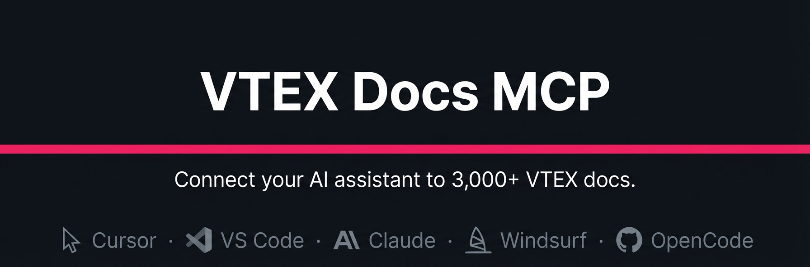

<p align="center">
  
</p>
<h1 align="center">VTEX Docs MCP</h1>
<p align="center">
  <strong>Connect your AI coding assistant to the full VTEX documentation — search and retrieve 3,000+ articles directly from your editor.</strong>
</p>
<p align="center">
  <a href="#quick-start">Quick Start</a> •
  <a href="#platform-setup">Platforms</a> •
  <a href="#available-tools">Available Tools</a> •
  <a href="#usage-examples">Examples</a> •
  <a href="#documentation-sources">Sources</a>
</p>
<p align="center">
  
  
  
  
  
</p>

---

## What is this?

The VTEX Docs MCP is a remote [Model Context Protocol](https://modelcontextprotocol.io) server that gives AI coding assistants direct access to VTEX's complete documentation. It covers both the [Help Center](https://help.vtex.com) and the [Developer Portal](https://developers.vtex.com) — over 3,000 articles on APIs, integrations, platform concepts, and implementation guides.

No API key or authentication required. Just add the server URL to your tool's config and start asking questions. Works with Cursor, VS Code, Claude, Windsurf, OpenCode, and any other tool that supports MCP.

---

## Documentation Sources

The content served by this MCP comes directly from two public repositories maintained by the VTEX Education team:

| Source | Repository | Content |
|---|---|---|
| [Help Center](https://help.vtex.com) | [`vtexdocs/help-center-content`](https://github.com/vtexdocs/help-center-content) | Tutorials, guides, and platform documentation |
| [Developer Portal](https://developers.vtex.com) | [`vtexdocs/dev-portal-content`](https://github.com/vtexdocs/dev-portal-content) | API references, integration guides, and developer documentation |

The MCP index updates automatically whenever these repositories are updated, so the documentation your AI assistant sees is always in sync with the latest published content.

**Found something wrong or missing?** Open a PR or issue directly in the content repository — improvements to the docs will be reflected in the MCP automatically.

---

## Quick Start

The fastest setup: create or edit `.cursor/mcp.json` in your project (or `~/.cursor/mcp.json` for global access) and paste this:

```json
{
  "mcpServers": {
    "vtex-docs": {
      "type": "sse",
      "url": "https://docs-assistant.vtex.com/api/mcp/sse"
    }
  }
}
```

That's it. See below for all platforms.

---

## Platform Setup

Each platform uses slightly different JSON keys. The configs below are exact — copy them as-is.

### Cursor

**File:** `.cursor/mcp.json` (project) or `~/.cursor/mcp.json` (global)

```json
{
  "mcpServers": {
    "vtex-docs": {
      "type": "sse",
      "url": "https://docs-assistant.vtex.com/api/mcp/sse"
    }
  }
}
```

### VS Code / GitHub Copilot

**File:** `.vscode/mcp.json`

> **Note:** VS Code uses `"servers"` as the top-level key, not `"mcpServers"`.

```json
{
  "servers": {
    "vtex-docs": {
      "type": "sse",
      "url": "https://docs-assistant.vtex.com/api/mcp/sse"
    }
  }
}
```

### Windsurf

Open the Command Palette and run **"Windsurf: Configure MCP Servers"**, or edit `~/.codeium/windsurf/mcp_config.json` directly.

> **Note:** Windsurf uses `"serverUrl"` and `"transport"` instead of `"url"` and `"type"`.

```json
{
  "mcpServers": {
    "vtex-docs": {
      "serverUrl": "https://docs-assistant.vtex.com/api/mcp/sse",
      "transport": "sse"
    }
  }
}
```

### Claude Code

Run this in your terminal:

```bash
claude mcp add --transport sse vtex-docs https://docs-assistant.vtex.com/api/mcp/sse
```

Or add a `.mcp.json` file at your project root (shareable with your team):

```json
{
  "mcpServers": {
    "vtex-docs": {
      "type": "sse",
      "url": "https://docs-assistant.vtex.com/api/mcp/sse"
    }
  }
}
```

### Claude Desktop

**File:** `~/Library/Application Support/Claude/claude_desktop_config.json` (macOS) or `%APPDATA%\Claude\claude_desktop_config.json` (Windows)

> **Note:** Claude Desktop doesn't support SSE natively. It needs the `mcp-remote` bridge, which proxies the SSE connection through stdio. Requires [Node.js](https://nodejs.org) installed.

```json
{
  "mcpServers": {
    "vtex-docs": {
      "command": "npx",
      "args": ["mcp-remote", "https://docs-assistant.vtex.com/api/mcp/sse"]
    }
  }
}
```

### OpenCode

**File:** `opencode.json` (project) or `~/.config/opencode/opencode.json` (global)

> **Note:** OpenCode uses `"mcp"` as the top-level key (not `"mcpServers"`) and `"type": "remote"`.

```json
{
  "$schema": "https://opencode.ai/config.json",
  "mcp": {
    "vtex-docs": {
      "type": "remote",
      "url": "https://docs-assistant.vtex.com/api/mcp/sse"
    }
  }
}
```

---

## Supported Platforms

| Platform | Config Format | Native SSE | Setup Complexity |
|---|---|---|---|
| **Cursor** | JSON | ✅ | One file, paste & go |
| **VS Code / Copilot** | JSON | ✅ | One file, paste & go |
| **Windsurf** | JSON | ✅ | One file, paste & go |
| **Claude Code** | CLI or JSON | ✅ | One command |
| **Claude Desktop** | JSON + mcp-remote | ⚠️ Needs bridge | Requires Node.js |
| **OpenCode** | JSON | ✅ | One file, paste & go |

---

## Available Tools

Once connected, your AI assistant has access to two tools:

| Tool | Description | Key Parameters |
|---|---|---|
| `search_documentation` | Hybrid semantic + keyword search across VTEX Help Center and Developer Portal | `query` (string), `locale` (en, es, pt), `limit` (1–50) |
| `fetch_document` | Retrieve the full content of a VTEX documentation article by URL | `url` (help.vtex.com or developers.vtex.com URL) |

The `search_documentation` tool returns ranked results with titles, URLs, and content excerpts. Use `fetch_document` to pull the full text of any article the search surfaces.

---

## Usage Examples

After setup, you can ask your AI assistant things like:

- *"Search the VTEX documentation for how to implement a payment provider connector"*
- *"Fetch the full guide at https://developers.vtex.com/docs/guides/payments-integration-payment-provider-protocol"*
- *"Find all VTEX docs about FastStore overrides and summarize the key patterns"*

The assistant will call the MCP tools automatically and ground its answers in the actual documentation.

---

## Troubleshooting

**Server not connecting**
Check that the URL is exactly `https://docs-assistant.vtex.com/api/mcp/sse` with no trailing slash.

**Claude Desktop: `mcp-remote` not found**
Make sure Node.js is installed (`node --version`). The `mcp-remote` package is fetched via `npx` on first run, so you need an internet connection and a working Node.js installation.

**Windsurf: server not recognized**
Use `"serverUrl"` (not `"url"`) and `"transport"` (not `"type"`). Windsurf's config format differs from the MCP standard.

**VS Code: tools not appearing**
Use `"servers"` as the top-level key in `.vscode/mcp.json`, not `"mcpServers"`. The VS Code MCP extension uses its own schema.

**OpenCode: server not loading**
Use `"mcp"` as the top-level key and `"type": "remote"`. OpenCode's config schema differs from Cursor's.

---

## License

MIT
